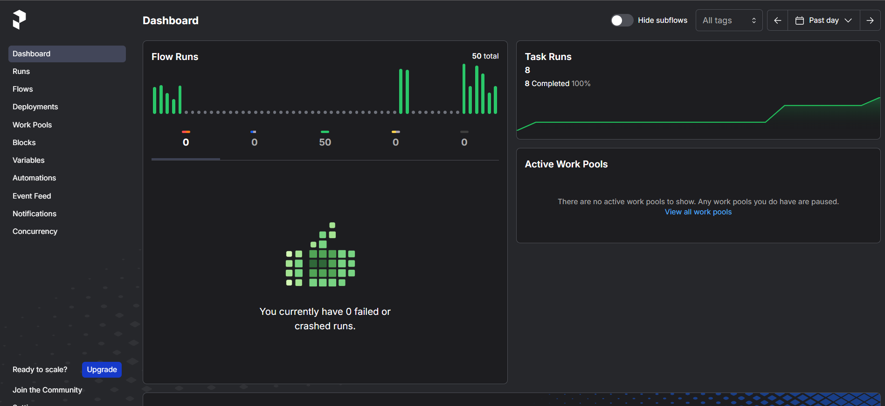

# __Functionality and Usage__

## __Pre Requisites__

- Linux OS(>= 22.04)
- Python(=3.12) 
- just (use ```sudo apt install just``` incase not installed)

## __Running the Application__

1. Clone the repository:
```git clone https://github.com/ashish142402004/nlp_customer_service.git```
2. Inside the main directory run the following commands:
    - For initial setup ```just setup```
    - To start unified logger run ```just run_logger```
    - To start the frontend and backend use ```just run```
    - The frontend runs on ```http://localhost:8501```
    - __Note:__ Please check if the backend is running before testing. Wait for a message like ```Server started at http://0.0.0.0:8000```
    - After the backend is successfully running please run the following commands in given order one after the other(we weren't able to combine them as they need to be run one by one after completion of the previous command.):-
        - ```ollama serve```
        - ```just prefect```
        - ```just mlflow```
        - ```just docker_build```
        - ```just docker_run```

## __Application Features__
---

# __Frontend__ 

## Customer Service Assistant – UI Description

This app is a **Streamlit-based interface** for simulating a customer service chat between an Agent and a Customer. It supports live chat, chat analysis, insights, and micro-skill evaluation for agents.

---

### Main Features

#### Role Selection 
- A sidebar with a **radio button** allows the user to choose between:
    - **Customer**
    - **Agent**

---

### Chat Interface

#### Auto-refresh
- Uses `st_autorefresh` to refresh the page every 30 seconds to keep chat updates in sync.

#### Chat Storage
- Chat messages are saved and read from `chat_cache/chat.json`.

#### Send Message
- User can enter a message via `st.text_input`.
- On clicking **"Send"**, the message is stored and the page reruns to reflect changes.

#### Close Chat
- On clicking "Close Chat":
    - The chat history is archived to a timestamped folder under `chat_log/`.
    - Default empty files are recreated to reset the app state.

---

### Chat Rendering
- Messages are displayed using `st.chat_message()`:
    - "user" for the customer
    - "assistant" for the agent

---

### Agent-Only Section: Contextual Insights

Visible only if `Agent` role is selected.

#### Get Insights Button
- On click, the following backend calls are triggered : 
    - **Summarization Service** → `http://127.0.0.1:8002/summarize`
    - **QA Evaluation** → `http://127.0.0.1:8004/evaluate`
    - **Micro Skill Evaluation** → `http://127.0.0.1:8008/ms-advance`
    - **Knowledge Base Analysis** → `http://127.0.0.1:8006/suggest_solution?type=1`
        - Currently , these 8 files are present for **Context-aware informaMon retrieval** :
              - billing_overview.md | feature_requests.md | login_issues.md | payment_issues.md | privacy_policy.md | refund_policy.md | subscription_plans.md | technical_support.md
    - **Proposed Solution** → `http://127.0.0.1:8006/suggest_solution?type=0`

---

### Agent Tabs

#### 1. Transcript Analysis
- Extracts issue category from the chat.
- Loads predefined rules from a YAML config file  and **RapidFuzz's** `token_sort_ratio` (threshold: 55) to match input text with required categories like: **Greetings** , **Disclaimers**, **Closing Statements**
- Uses **regex patterns** to detect and flag personal/sensitive info (e.g., account numbers, PINs, emails).Rule compliances.
- Displays current Sentiment Analysis by combining **TextBlob** for polarity detection with keyword boosting from config.

#### 2. Quality Assurance
- Evaluates agent's response quality

#### 3. Suggested Responses
- Displays past successful agent responses.

#### 4. KB Insights
- Shows potential answers pulled from internal documentation.

#### 5. Micro-Skill Advancement
- Displays skill ratings (e.g., empathy, professionalism) on a 5-point scale.

---

###  Additional Actions for Agents

#### Get Current Summary
- Regenerates chat summary using the summarization API and shows it.

#### Raise Ticket
- Auto-assigns ticket priority based on the issue category identified by the LLM.
- Allows agent to add additional information to the ticket and stores them in the ticket log folder.

---

###  File Storage Paths

- `chat_cache/chat.json` – Chat logs
- `chat_cache/summary.txt` – Summarized insights
- `chat_cache/hist_sum.txt` – Historical summary
- `chat_cache/kb.txt` – KB-based suggestions
- `chat_cache/solution.txt` – Suggested solution
- `chat_cache/qa.txt` – QA evaluation
- `chat_cache/ms_adv.txt` – Micro skill scores
- `ticket_log/` – Log tickets
- `chat_log/` – Archived closed chat sessions

---


## __Backend__ 

##  Services Overview

Each microservice is containerized and exposes a REST endpoint. Most services leverage asynchronous FastAPI routes and `async` HTTPX calls to improve performance.

---

### 1. Micro-Skill Evaluation (`ms_advance`) 
    1. Receives conversation text  and Returns JSON ratings for skills (clarity, empathy, etc.)

### 2. Quality Assurance (`quality_assurance`)
    1. Accepts agent response  and  Returns JSON adherence report

### 3. Solution Suggestions (`suggestions`)
    1. Fetches similar transcripts via async embedding + vector search 
    2. Prepares prompt from best examples and Returns suggested text

### 4. Summarization (`summarizer_llm`)
    1. Receives conversation  and Returns summary output

### 5. Document Search (`doc_search`)

- **Components:**
    - `Embedder` uses SentenceTransformer to vectorize documents  
    - `TranscriptIndex` builds and queries HNSWLib vector index  
    - Decorated with MLflow tracking 


##  Configuration & Deployment

- **Global config:** `config.yaml` defines shared model hosts and API URLs  
- **Service-level config:** Each service (e.g. `llm_config.yaml`) sets its own host/model parameters  
- **Dockerized:** Each sub-app has a Dockerfile  
- **Compose:** `docker-compose.yaml` under `/app` builds and runs all services  

---


Sample Screenshot of MLflow run


Sample Screenshot of Prefect run


## __Known Issues:__

- additional mkdocs or logging server running in the background: use lsof -i :<port_number> tp identify the process_id. Use kill -9 process_id . mkdocs may cause backend failure as it runs on same port. Please ensure it is killed before starting the project.
- Due to a limitation of streamlit's navigation functionality, buttons like Next which is used for navigation need to be clicked twice to switch page. For example, in registration form step 1, after uploading the document click on next button once. After a success toast message reclick the button to go to the next page. Similar functionality for all the remaining buttons that involve page navigations. 
- During ruff checks there was 1 failure 'S105', it is happening on account_password, mistaking the regex for a hardcoded secret. But it's just a pattern for validating strong passwords. We added `# noqa: S105` to skip the false warning safely.


<div class="grid cards" markdown>
  - [__<- App Architecture__](architecture.md)
  - [__Learning Experience ->__](experience.md)
</div>